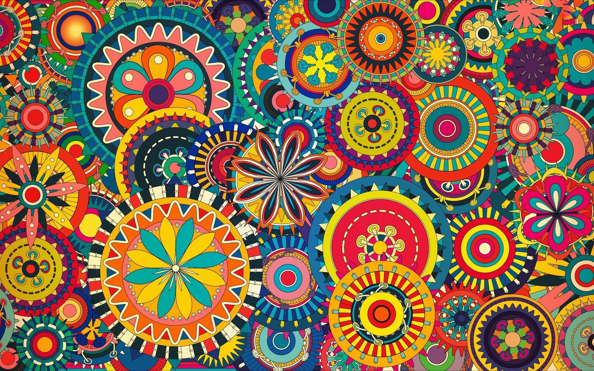

# Colour-Analyser---Data-Analytics
Three different colors Red, Green and Blue are being tracked by utilizing the fundamental of computer vision. After successful compilation when we execute the code a window redirects to the image displayed on it whose path is given as an argument
<table style="width:100%">
  <tr>
    <th></th>
    <th></th>
    
  </tr>
  
  <tr>
    <th></th>
    <th></th>
    </tr>

</table>
